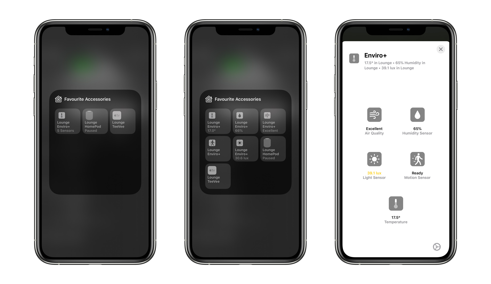

# HomeKit Enviro+
An [Apple HomeKit](https://developer.apple.com/homekit/) accessory for the [Pimoroni Enviro+](https://shop.pimoroni.com/products/enviro?variant=31155658457171) running on a Raspberry Pi.

## Dependencies

* [**Go**](http://golang.org/doc/install) - this accessory is written in Go
* [**HomeControl**](https://github.com/brutella/hc) - to expose climate readings from the Enviro+ as an Apple HomeKit accessory
* [**enviroplus-exporter**](https://github.com/sighmon/enviroplus_exporter) - to read the sensors of the Enviro+ and export them for scraping by [Prometheus](https://prometheus.io)

## Installation

Install this on a Raspberry Pi, or test it on macOS.

### Setup

1. Install [Go](http://golang.org/doc/install) >= 1.14 ([useful Gist](https://gist.github.com/pcgeek86/0206d688e6760fe4504ba405024e887c) for Raspberry Pi)
1. Clone this project: `git clone https://github.com/sighmon/homekit-enviroplus` and then `cd homekit-enviroplus`
1. Install the Go dependencies: `go get`
1. Install and run the Prometheus [enviroplus-exporter](https://github.com/sighmon/enviroplus_exporter)
1. Optionally if you'd prefer a Docker container of the exporter, see: [balena-enviro-plus](https://github.com/sighmon/balena-enviro-plus)

### Build

1. To build this accessory: `go build homekit-enviroplus.go`
1. To cross-compile for Raspberry Pi on macOS: `env GOOS=linux GOARCH=arm GOARM=7 go build homekit-enviroplus.go`

### Run

1. Execute the executable: `./homekit-enviroplus`
1. Or run with the command: `go run homekit-enviroplus.go`

### Start automatically at boot

1. sudo cp homekit-enviro.service /lib/systemd/system/homekit-enviro.service
2. sudo systemctl daemon-reload
3. sudo systemctl enable homekit-enviro.service
4. sudo systemctl start homekit-enviro.service

### Optional flags

The flag defaults can be overridden by handing them in at runtime:

* `-host=http://0.0.0.0` The host of your Enviro+ sensor
* `-port=1006` The port of your Enviro+ sensor
* `-sleep=5s` The [time](https://golang.org/pkg/time/#ParseDuration) between updating the accessory with sensor readings (`5s` equals five seconds)
* `-dev` This turns on development mode to return a random temperature reading without needing to have an Enviro+

e.g. to override the port run: `go run homekit-enviroplus.go -port=8000` or `./homekit-enviroplus -port=8000`

## Reset this accessory

If you uninstall this accessory from your Apple Home, you'll also need to delete the stored data for it to be able to be re-added.

### macOS

1. Delete the data in the folder created: `homekit-enviroplus/Enviro+/`
1. Restart the executable

### Raspberry Pi

1. Remove the persistent data: `rm -rf /var/lib/homekit-enviroplus/data`
1. Restart the Raspberry Pi

## Thanks

This project uses the amazing work of [Matthias](https://github.com/brutella). Please consider donating if you found this useful.
